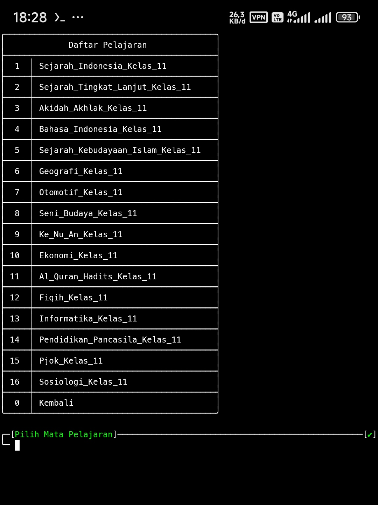
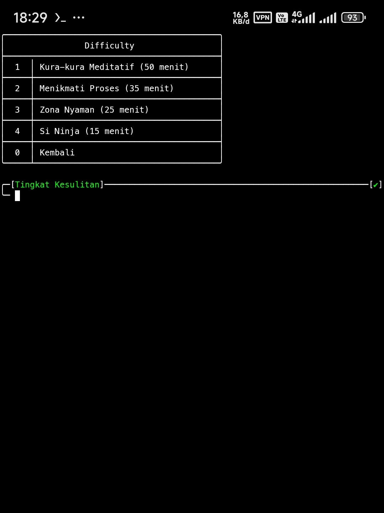
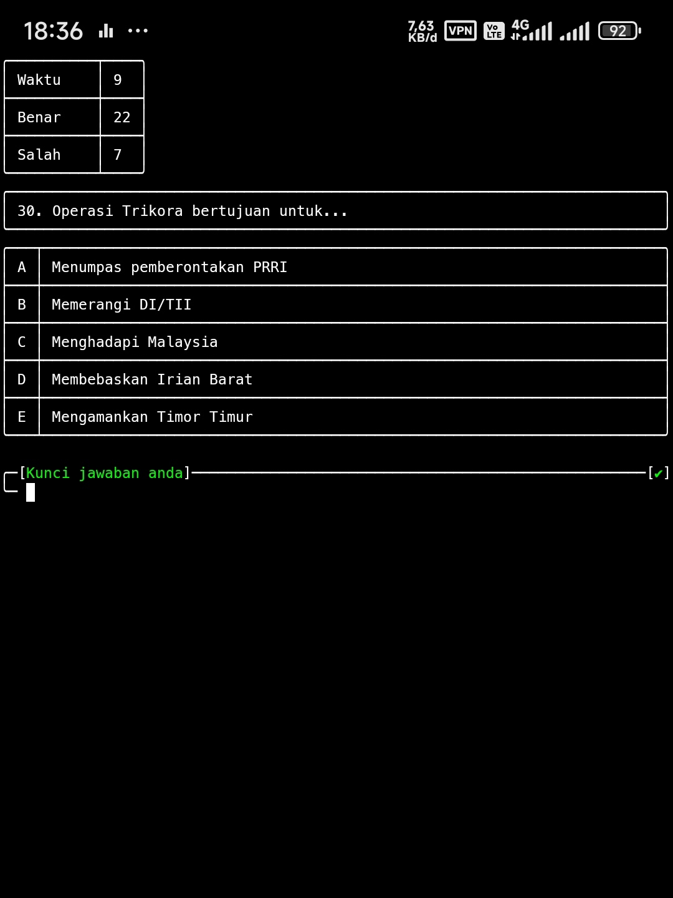
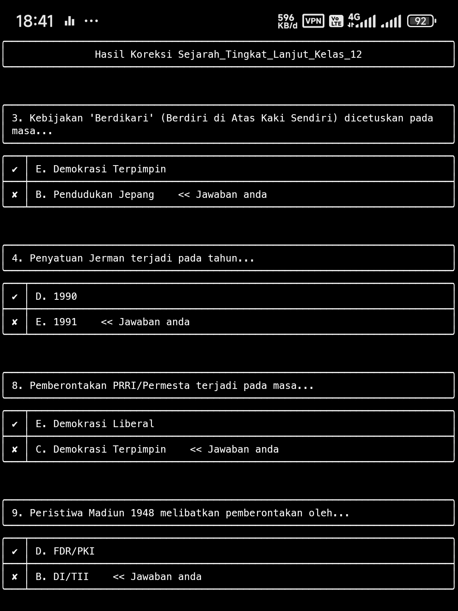
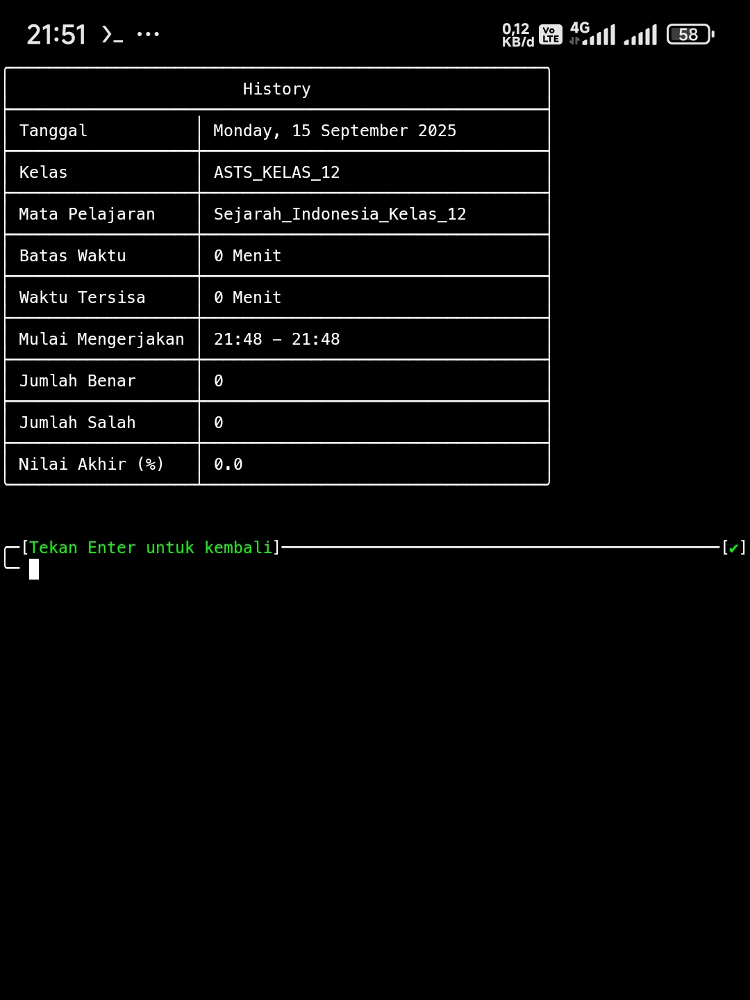

# FQuiz

Aplikasi kuis berbasis CLI (Command Line Interface) untuk pembelajaran interaktif. Pengguna dapat memilih kelas dan mata pelajaran.

## Fitur
- **Pemilihan Kelas & Mapel**:
  - Baru tersedia beberapa kelas dan pelajaran saja

- **Monitoring**:
  - Batas waktu tersisa
  - Jumlah benar dan salah saat dijalankan

- **Sistem Penilaian Otomatis**:
  - Hitung nilai akhir (persentase)
  - Durasi pengerjaan

- **Riwayat**:
  - Database Lokal (SQLite3)
  - Data yang disimpan:
    - Tanggal
    - Kelas
    - Mata Pelajaran
    - Batas Waktu
    - Waktu Tersisa
    - Waktu Mulai - Selesai Mengerjakan
    - Jumlah Benar
    - Jumlah Salah
    - Nilai Akhir

- **Fitur Lainnya**:
  - Koreksi jawaban otomatis
  - Auto-stop saat melebihi batas waktu
  - Developer tools untuk mengolah soal (beta)

## Prasyarat
- Python 3.x+
- Git (untuk clone repository)

## Instalasi

1. Clone repository
```bash
git clone https://github.com/FenrixSeff/FQuiz.git
```
2. Masuk ke direktori
```bash
cd FQuiz
```
## Penggunaan
Jalankan program dengan perintah:

```bash
python fquiz.py
```
## Demo
- Daftar Mata Pelajaran



- Tabel Batas Waktu



- Tampilan saat mengerjakan soal



- Koreksi otomatis



- Tabel riwayat



## Status Pengembangan

Project ini masih dalam tahap pengembangan. Fitur dan fungsionalitas dapat berubah sewaktu-waktu.

## Kontribusi

Kontribusi dan saran sangat diterima. Silakan buat Issue atau Pull Request

## Pengembang

- **GitHub**: [FenrixSeff](https://github.com/FenrixSeff)
- **Instagram**: [seff_hi7](https://instagram.com/seff_hi7)

**License**: Open-source
