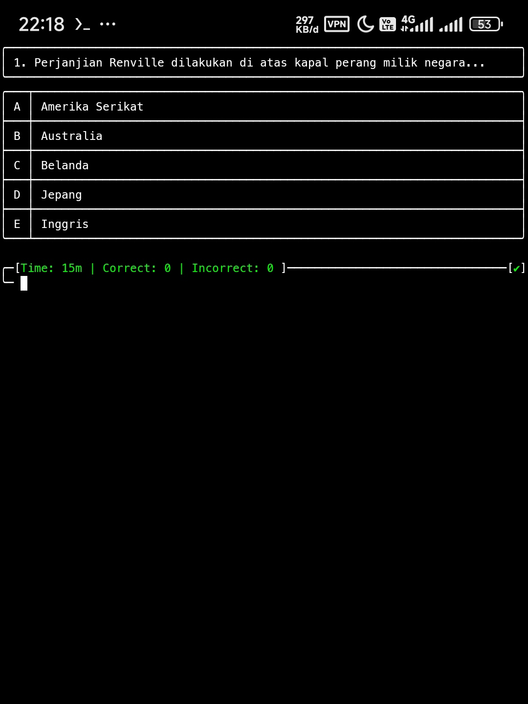

# FQuiz

Aplikasi kuis berbasis CLI (Command Line Interface) untuk pembelajaran interaktif. Pengguna dapat memilih kelas dan mata pelajaran.


## Fitur

- **Pemilihan Kelas & Mata Pelajaran**
  Tersedia berbagai pilihan kelas dan mata pelajaran

- **Monitoring Real-time**
  - Penghitungan waktu pengerjaan
  - Statistik benar/salah selama mengerjakan

- **Sistem Penilaian Otomatis**
  - Perhitungan nilai akhir (persentase)
  - Durasi pengerjaan otomatis

- **Riwayat Terintegrasi**
  - Database SQLite3 lokal
  - Menyimpan data lengkap:
    - Tanggal pengerjaan
    - Kelas & mata pelajaran
    - Batas waktu & waktu tersisa
    - Waktu mulai & selesai
    - Jumlah benar & salah
    - Nilai akhir

- **Fitur Lainnya**:
  - Koreksi jawaban otomatis
  - Auto-stop saat melebihi batas waktu
  - Developer tools untuk mengolah soal (beta)


## Prasyarat

- Python 3.x+
- Git (untuk clone repository)

## Instalasi & Konfigurasi

1. **Clone repository**
   ```bash
   git clone https://github.com/FenrixSeff/FQuiz.git
```

1. Masuk ke direktori project
   ```bash
   cd FQuiz
   ```
2. Konfigurasi settings
   · Salin file contoh:
     ```bash
     cp settings.toml.example settings.toml
     ```
   - Edit file settings.toml dengan editor teks yang ada punya:
     ```bash
     nano settings.toml
     # atau
     micro settings.toml
     ```
3. Jalankan aplikasi
   ```bash
   python fquiz.py
   ```

## Demo

- Daftar Mata Pelajaran


- Tabel Batas Waktu


- Tampilan saat mengerjakan soal



- Koreksi otomatis


- Tabel riwayat


## Kontribusi

Kontribusi dan saran sangat diterima. Silakan buat Issue atau Pull Request

## Pengembang

- **GitHub**: [FenrixSeff](https://github.com/FenrixSeff)
- **Instagram**: [seff_hi7](https://instagram.com/seff_hi7)

**License**: Open-source
